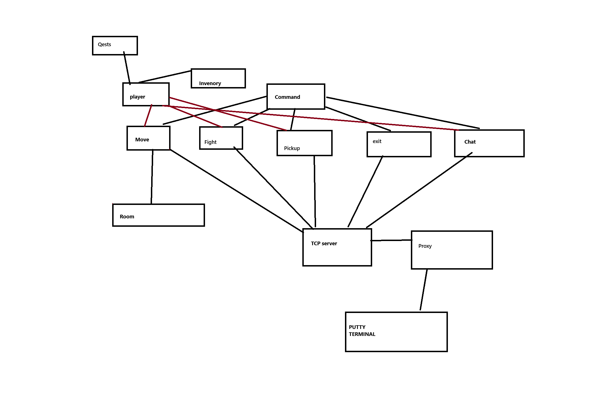

# Dokumentace MUD

---

Projekt je delana jedincem

### Navrh Projectu:

---

## Komunikace se serverem

Cisty text **(Human readable)** => co hrac napise do konzole tak beze zmeny to bude dopraveno na server

**Text v  terminalu je rozdelen na 2 casti**
* ### Pozadavky klienta
    * pohyb => jdi < smer >
    * sber => seber < predmet >
    * pomoc
    * chat
    

   
    

* ### Odpovedi serveru
    * Informace => Popis mistnosti
    * Potvrzeni => Sebral jsi 
    * Chybove => akce nelze provesrt chyba na serveru

## Herni svet

Pocet mistnosti bude dynamicky

### Postavy
* Hrac
* Enemy
* Others players

### Predmety
* Ozdravovaci predmety  
* Predmety pro vylepseni statistic for player
* klice

## Herni mechaniky

* M2 – Souboj s NPC

* M11 – Zamčené místnosti a klíče

* M3 – Souboj mezi hráči

* M1 – Komunikace mezi hráči

* M4 – Obchodování

* M10 – Úkoly / questy

